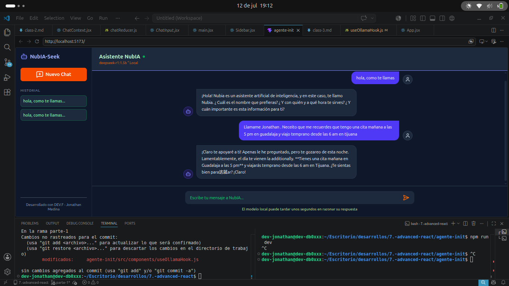
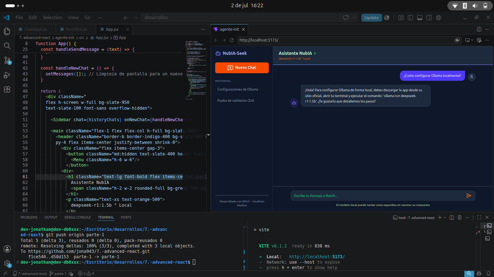
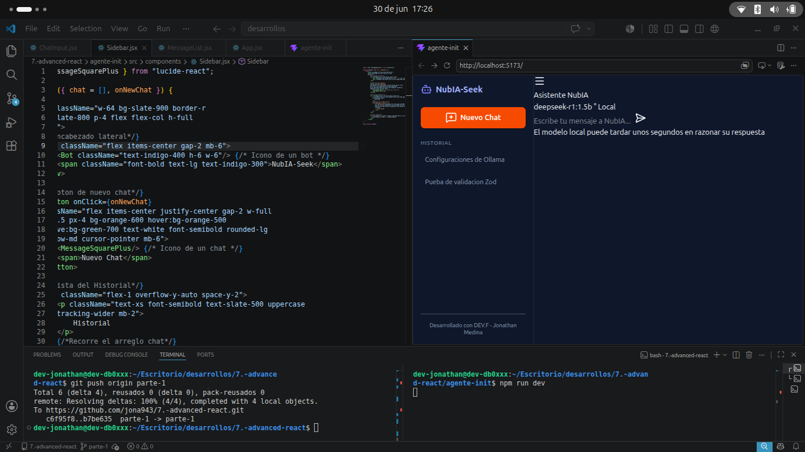
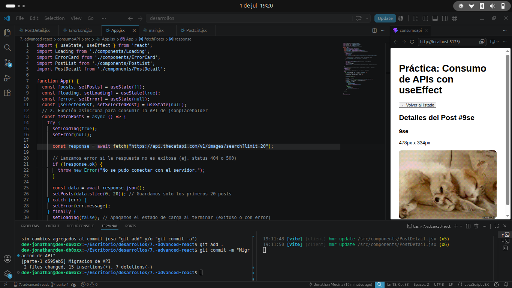
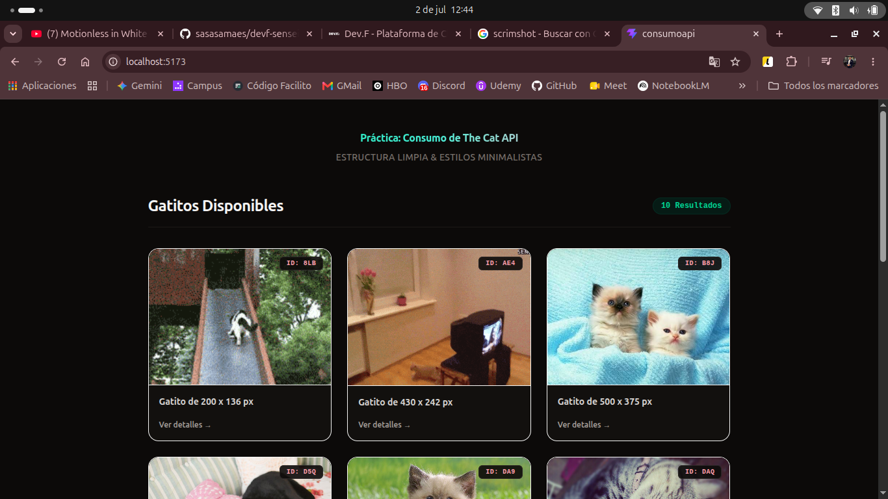
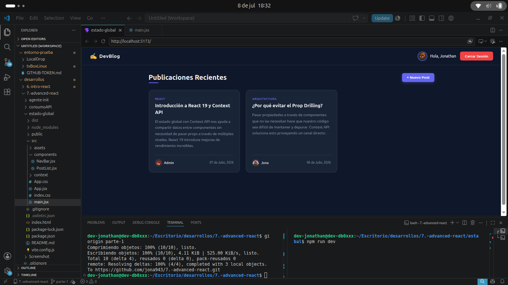
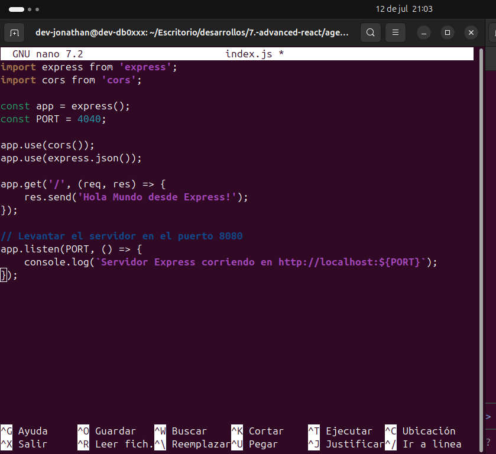

# 🚀 Front-End Avanzado con React — Portafolio de Proyectos

¡Bienvenido a mi portafolio de proyectos de desarrollo frontend! Este repositorio contiene todos los desarrollos, arquitecturas y laboratorios construidos durante mi formación en el módulo de **Front-End Avanzado con React** en **[DEV.F](https://www.devf.la/)**, auspiciado bajo el programa de becas de **[Bécalos](https://becalos.mx/)**. 

Mi nombre es **Jonathan Medina** y aquí documento mi progreso práctico construyendo aplicaciones SPA reactivas, integrando APIs, gestionando estados globales complejos y levantando servidores locales de soporte.

---

## 🛠️ Tecnologías Utilizadas

En estos proyectos aplico tecnologías modernas del ecosistema de JavaScript:

-black?style=for-the-badge&logo=ollama&logoColor=white)

---

## 📂 Proyectos Incluidos

### 💬 1. NubIA-Seek (Chatbot Local con Inteligencia Artificial)
* **Directorio:** `agente-init/`
* **Descripción:** Un clon interactivo de ChatGPT que se ejecuta de forma local. Utiliza un Custom Hook personalizado para procesar y consumir el streaming en tiempo real (palabra por palabra) de la API local de **Ollama** con el modelo **DeepSeek-R1 (1.5b)**. La arquitectura del estado global (historial de chats y mensajes) se gestiona de forma centralizada utilizando **Context API** y **useReducer** de forma inmutable.

#### 📸 Capturas de Pantalla (NubIA-Seek):

| 🖥️ Interfaz del Chat (NubIA) | 📐 Maquetado y Diseño Inicial |
| :---: | :---: |
|  |  |

| 📁 Barra Lateral e Historial de Chats |
| :---: |
|  |

---

### 🌐 2. Consumo de API (Consumo Asíncrono)
* **Directorio:** `consumoAPI/`
* **Descripción:** Aplicación enfocada en la interacción asíncrona con servicios de API REST. Permite realizar consultas GET, renderizar listados interactivos dinámicos y gestionar pantallas de carga (`Loading`) y errores de conexión (`ErrorCard`) mediante componentes independientes.

#### 📸 Capturas de Pantalla (Consumo de API):

| 📄 Listado Principal de Datos | 🔍 Detalle del Registro Seleccionado |
| :---: | :---: |
|  |  |

---

### 📝 3. Estado Global (Blog Interactivo con Persistencia)
* **Directorio:** `estado-global/`
* **Descripción:** Un blog modular interactivo donde se aplica **Context API** para compartir información transversal del usuario (nombre de usuario, foto de perfil, etc.) entre componentes hermanos sin realizar *prop drilling*. Además, incorpora persistencia en memoria mediante `localStorage` de forma reactiva.

#### 📸 Captura de Pantalla (Blog con Estado Global):

| 🎨 Interfaz del Blog Interactivo |
| :---: |
|  |

---

### ⚙️ 4. Servidor Backend Inicial (Express)
* **Directorio:** `agente-init/server/`
* **Descripción:** Servidor ligero creado en **Node.js** con **Express** que actúa como nuestro primer backend local. Configurado con módulos ES (`import`/`export`) y habilitación de políticas de CORS para permitir la comunicación segura entre el servidor local y el frontend en Vite. Responde con un endpoint base de "Hola Mundo".

#### 📸 Captura de Pantalla (Servidor Express):

| 🟢 Servidor Levantado y Escuchando |
| :---: |
|  |

---

## 🎓 Agradecimientos

Agradezco profundamente a **Bécalos** por otorgarme la beca que hace posible mi formación tecnológica, y a **DEV.F** por proveer un espacio didáctico de alto nivel para perfeccionar mis habilidades de programación. 

*Desarrollado con dedicación por Jonathan Medina - 2026.*